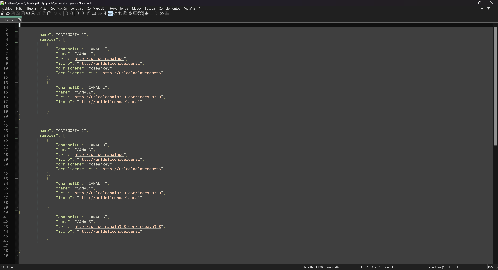
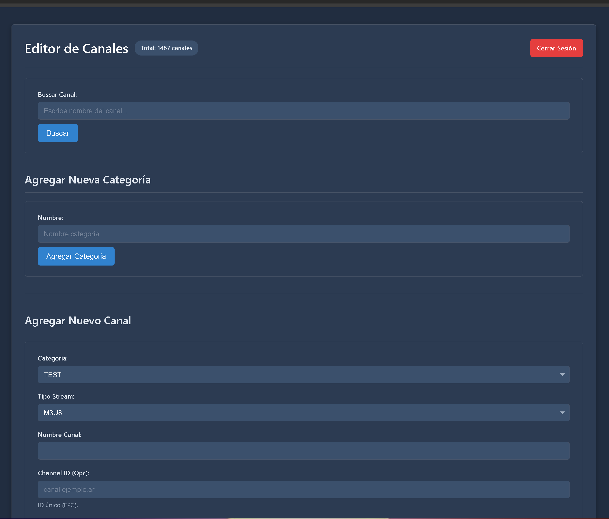

# OnlySports
Comparto todo el código de la aplicación para quién quiera modificarla y usarla.

Está optimizada para usarla en dispositivos con Android TV o Google TV pero funciona en teléfonos y tablets con Android. La aplicación usa la libreria Exoplayer de Media3 para reproducir los canales.

El funcionamiento básico es:
- Carga una lista de canales remota en formato JSON (que se adjunta el ejemplo para que puedan subir a un servidor externo).
- La lista de canales por seguridad está codificada en el servidor, la app la decodifica con sus respectivas claves para mas seguridad.
- En esta versión está desactivada la función de Login de usuarios para evitar problemas, se puede activar (sí no saben programar usen IA).
- Al estar optimizado para TVs al subir/bajar con las teclas del control remoto cambia al canal anterior/siguiente.
- Al sistema lo diseñé pensando en que un canal puede tener una o mas fuentes por lo cual sí una falla carga la siguiente hasta que no haya mas que probar.
- Como dije en lo anterior al poder tener varias fuentes de un mismo canal al presionar con el OK del control remoto dos veces cambia a la fuente siguiente.
- Acepta archivos m3u8 y MPD con licencia remota.
- Se adjunta panel de control en PHP que permite agregar/modificar/eliminar tanto las categorías como los canales.
- También se adjunta panel que permite codificar la lista para su primer uso y que la app la pueda leer.
- Suponiendo que hay canales que pueden tener mas de un audio y/o subtítulos al presionar la tecla hacia la derecha cambia al siguiente audio en caso que haya. Con la flecha a la izquierda cambia a los subtítulos en caso que hayan.
- Los canales se identifican en la lista de canales con un channelID, por ej. hay varios canales con el mismo channelID va a mostrar el nombre del primero de la lista y en caso que falle el primer stream va a probar el segundo automáticamente y así hasta que termine el mismo channelID.
- El PHP que administra los canales al agregar un canal sí o sí necesita un archivo para el logo, en caso de no tenerlo va a agregar el canal pero la app va a dar error al cargar la lista de canales. Dicho PHP hace una copia en la carpeta que se defina del servidor de los logos para un uso mas optimizado y un acceso sin problemas a los logos de cada canal.
- Funciona en cualquier servidor remoto que permita ejecutar PHP y acceder al JSON remoto. El panel al agregar, eliminar, etc. canal/categoría automáticamente actualiza la lista de canales y la encripta. Se pierde la clave y se pierde TODA la lista de canales que se haya cargado.
- La app muestra EPG (Electronic Programming Guide) de cada canal en caso que el XML remoto lo posea a dicho canal. El EPG se muestra sí el channelID de cada canal coincide con el archivo XML del EPG.
- Para modificar el EPG en la pantalla de Configuración se puede definir el EPG remoto y cada cuanto tiempo se desea actualizar.

El EPG para Argentina está basado en los channelID de este archivo.
https://www.open-epg.com/files/argentina4.xml.txt

Y el XML que carga los datos del EPG de dichos canales.
https://www.open-epg.com/files/argentina4.xml

Al cargar la aplicación carga el EPG por primera vez, luego carga solo cada el intervalo de horas que se le especifique, por defecto 24 hs.

En la pantalla de **Configuración** hay un botón de Comprobar Canales que usa un PIN específico para chequear toda la lista de canales e informar en pantalla sí alguno o todos los links de un canal fallan o sí están operativos. El PIN por defecto es 12345678. En el archivo /viewmodel/ChannelDiagnosticsScreenViewModel.kt en la línea: **val secretCode = "12345678"**

En el archivo **/util/EncryptionHelper.kt** se deben definir las claves que se usaran en el servidor para encriptar/desencriptar la lista de canales. Sí las dos claves no coinciden los canales no se van a cargar. Se puede usar un generador online para generar o alguna IA se le pide que genere una clave AES y su respectiva clave secundaria o usar un generador online como: **https://generate-random.org/encryption-key-generator**

Para definir la lista remota hay que editar el archivo **/data/local/PrefKeys.kt**.
En el archivo **/data/remote/RetrofitClient.kt** hay que editar donde aparece **http://localhost/** con la URL base del dominio que utilice, sí utilizan un VPN puede ser **http://IP**
En el archivo **/data/repository/ChannelRepository.kt** donde aparece **http://IP/lista.json** hay que poner la dirección exacta del JSON encriptado que contiene los canales.

Pasos para que la aplicación funcione:
1- En la carpeta que dice Server debe ser subida a un hosting o usarla localmente para generar el JSON encriptado y luego ser subido a un hosting externo. Dentro de todos los archivos debe estar la misma clave AES que usará la app para desencriptar los canales.
2- **api_login.php y api_validate.php** son los archivos que manejan los usuarios que se generan con user.php (la clave para acceder al panel de usuarios está dentro del PHP).
3- **encriptar.php** es el archivo que hay que ejecutar la primera vez para encriptar la lista de canales y que el Panel de Administración de canales puede leerlo y modificarlo.
4- **index.php** es el archivo del Panel de control para los canales y categorías, desde ahí se modifica todo lo que la app va a leer. Por defecto es **admin y admin**.
5- Dentro de **users.php** está la clave para ingresar al Panel de Usuarios, se debe cambiar.
6- Una vez modificados todos los archivos con la misma clave AES se puede ejecutar cada uno de los archivos para así agregar/borrar usuarios (que no está implementado, por defecto no pide Login) y que la app lea el archivo.
### **Tener en cuenta que sí no es la misma clave AES en todos los archivos y en la app no va a funcionar!**

La aplicación sí la lista es extensa suelen ser "pesada" en ciertos dispositivos con poca RAM.

Básicamente eso es lo que recuerdo por ahora, a medida que voy viendo de agregar nuevas funciones seguramente actualice el repositorio. Sí les sirve o sí ven que algo falla pueden avisar.

Para editar dichos archivos se puede usar **Android Studio 2024.3.2** o superior aunque seguramente funcione en otras versiones.

### El uso de la app es LEGAL, sí alguien hace mal uso de ella no me hago cargo ;)

Este es un ejemplo de como sería la lista de canales:

Los campos son:
**channelID** identificador único de cada canal (igual que el EPG sí se quiere utilizar).
**name** el nombre del canal, como aparecerá en la lista.
**uri** es la URL del canal, sí es MPD busca la licencia en el campo **drm_license_uri** si es m3u8 ignora dicho campo.
**icono** es el logo del canal.
**drm_scheme** por lo gral. cuando es MPD suelen ser encriptados en clearkey pero todo depende del servidor, puede ser widevine, etc. sí es m3u8 ese campo se ignora.
**drm_license_uri** es la URL de la licencia para abrir el canal MPD encriptado, sí el canal es MPD sin encriptación no es necesario completar este campo.

## Los campos OBLIGATORIOS son "channelID", "name", "uri" y "icono". Sí falta alguno de esos la app no va a cargar.

Panel de control:

